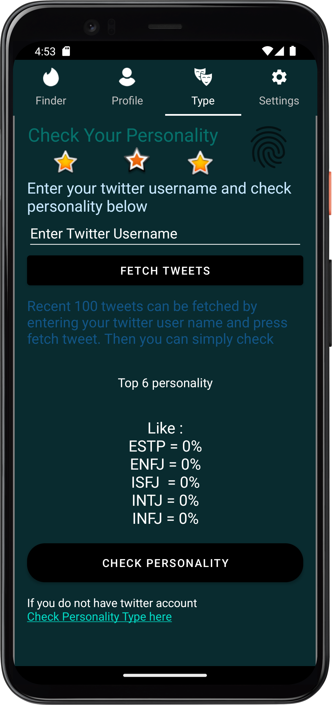
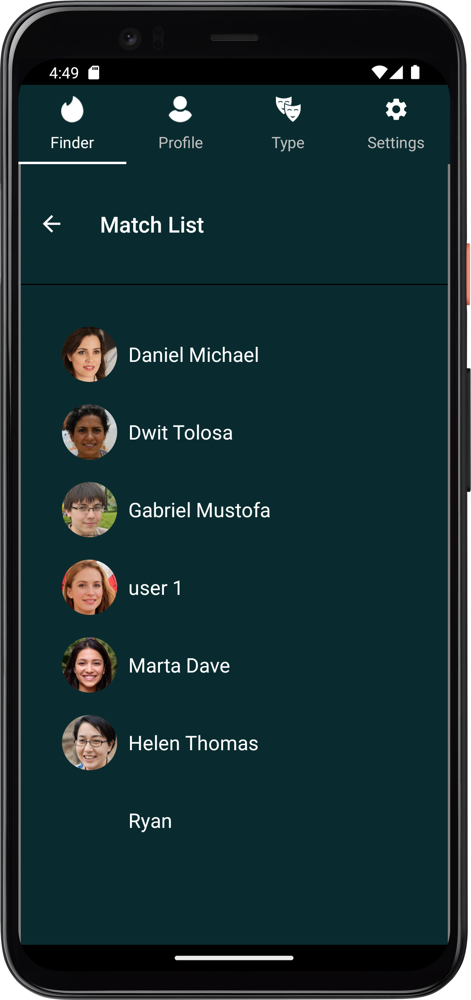

# Personality-based-Dating-App

# Personality based Dating Application using NLP from Twitter Tweets

- This dating application is simple and smart to predict your personality from tweets which can be used to find matches around you area.
- The uses trained model using Natural Language Processing(NLP)-Transformers to predict 16 - MBTI personality type.
- The user can like and dislike or swipe right and  left based of their preference using location, personality type, and other details of other users. 
- Once the match is found the user be able to chat to facilitate communications. 

# Tech stack
 ## Android
 - Java - For programming 
 - XML - For UI design
 - Cloud based Firebase Firestore - For creating collections and documents used as database and messaging 
 - Firebase Storage  - To store user images
 - Firebase Cloud Messaging - To implement push notification
 - Firebase Authentication - For user registration and related tasks 
 - Espresso Testing and Unit Testing - To test the app functionality including end to end test

 ## Machine Learning
 - TensorFlow and TensorFlow Hub - For developing personality classifier using python 
 - Transformer - BERT - To Train and fine-tune the model
 - NLPAUG - For augmenting texts to train NLP based model 
 - TFLITE Model Maker - To train the model
 - Neural network - To develop the structure of the model before training
 - NLP Classifier - Java library to run  the .tfl file and execute classification of the trained model
 - ROC-AUC, Confusion Matrix, Training and validation accuracy- Used to test the model

 - Backstory: This app adds features of predicting personality from users of  large tweets(texts) which integrates android application with machine learning to make apps more smart. The app also has features which are helpful to find love ones and even make friends and be able to communicate.
 - It can be expanded and more features can be added. So if I feel to add more features or add new personality classifier model with better accuracy I will update it. Please use this resource for learning purpose only. 
